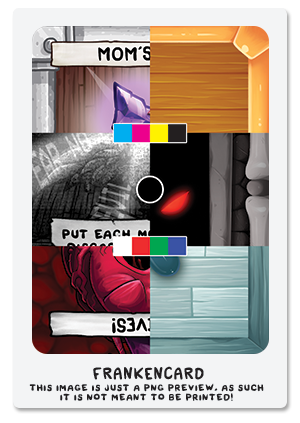

# FrankenCard

<p align="middle">
  <sub>v1.0</sub><br>
  <br>
  <a href="https://github.com/duckyb/four-souls-test-print/releases/latest">
    
  </a>
</p>

## Description
This custom card is designed to probe the print quality and accuracy of a custom card manufacturer.

It is composed of a selected set of images to gather as much information as possible per printed copy.

### 1. The marking area
In the center of the image there is an empty circle. In this area you will **insert a number / letter of your choice to mark the card**. After saving a copy, you can do some color correction to the base image, and change the marking.

Repeat this process as many times as necessary.

After ordering all of your corrected versions, you can compare them to an original card, and determine which of the edits that you did more closely matches the original.

### 2. The color strips

Self, explanatory. The north strip is a **CMYK pure ink test**, the south strip is a white (paper color) + **RGB color test**.

### 3. The cards

#### Mom's Ring

This card was selected because it is **one of the first cards of the new batch** that will be publicly available.  
It also adds some purple that was missing in the test.

#### Treasure Card Back

This was chosen for obvious reasons. It's **one of the most apparent mismatches** with custom/proxy cards so far.

#### TV Static

This card is also one of the first cards of the new batch that people will be able to compare.  
It was added as a **black & white + text test**.

#### Monster Card Back

This back also comes out different from the original, often having a **blue shift**.

#### It Lives!

It lives was added because it's a card that **features a lot of red** (a color difficult to print accurately), and because the original card was produced by the same printers used for the v2 base game (alegedly).

#### Loot Card Back

The loot card is **another problematic card back** that is often printed in different tones of blue/green.

## Printer Settings

```
Paper Weight: 300 gsm
Paper Stock: M31 Linen
Paper Finish: Standard (MPC Game Card Finish)
Card Dimensions: 2.5" × 3.5" (63.5 × 88.9 mm)
Corner Radius: 3mm
```

## How it was made

1. I contacted MPC (makeplayingcards.com) and asked them what CMYK colour profile they recommend for M31 linen paper. They sent me the ICC profile that you can find in this repository. (`HP Indigo Gloss Exp05 Ink 2880 v3.1`)
2. I installed the provided colour profile.
3. I downloaded all of the featured cards from foursouls.com
4. I opened each card in photoshop and applied the following steps
5. Verified setting in `Photoshop > Edit > Color Settings...`


6. Changed the color mode to CMYK `Photoshop > Image > Mode > CMYK Color`

This is a preview of how the colour mode conversion affects the original files:


7. Each images was saved as a separate `.tif` file.
8. All `.tif` files were imported in a new photoshop document (with the same colour mode / settings) and edited into the final result.
